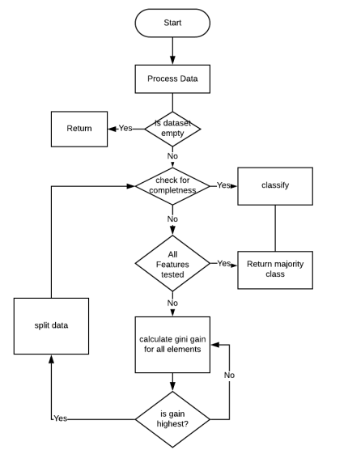
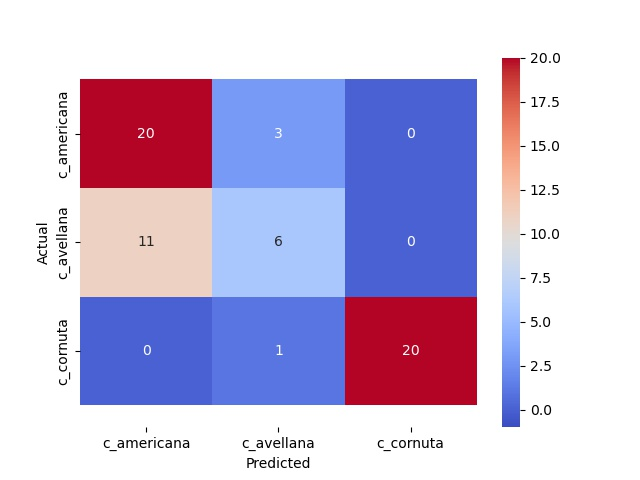

# Decision Tree From Scratch

This code is a python implementation of a DecisionTreeClassifier using the CART algorithm.

This implementation of the CART algorithm uses pandas to read and write the input and output files and
numpy to do the feature selection by doing element wise calculations on subsets of the data. The program flow can be 
seen on the flowchart below. 

The most interesting methods are the calculation of the Gini Index and Gini Gain, and a brute force method to split each
feature into branches above and below a threshold, using every element of the feature as the threshold value to do this 
calculation. Repeat for every feature and pick the column and threshold value as the combination that returns the best Gini Gain 
score.

The other important method is the build_tree method. This method recursively builds the tree, splitting on the feature 
and value that increases information purity each time and creating child nodes at this split value using the split 
methods.



The code is integrated with scikit-learn to split the training and test data and generate metrics.
```
## Example Output
Processing....
Namespace(Transpose=True, file='hazelnuts.txt', func=<function create_dataframe at 0x7f7be029d7a0>)
Cross Validation scores for best GridSearchCV in Cart DecisionTree are:
score  0 :  0.8571428571428571
score  1 :  0.7857142857142857
score  2 :  0.8571428571428571
score  3 :  1.0
score  4 :  0.9285714285714286
score  5 :  0.9285714285714286
score  6 :  0.8571428571428571
score  7 :  0.9285714285714286
score  8 :  0.9285714285714286
---------------------------------------------------------------
accuracy_score against test set for Cart DecisionTree implementation: 75.41 %
precision    recall  f1-score   support

c_americana     0.65      0.87      0.74        23
c_avellana      0.60      0.35      0.44        17
c_cornuta       1.00      0.95      0.98        21

accuracy                            0.75        61
macro avg       0.75      0.72      0.72        61
weighted avg    0.75      0.75      0.74        61

accuracy_score against test set for sklearn decisiontree with gini is: 75.41 %
---------------------------------------------------------------
              precision    recall  f1-score   support

c_americana     0.67      0.78      0.72        23
c_avellana      0.64      0.53      0.58        17
c_cornuta       0.95      0.90      0.93        21

accuracy                            0.75        61
macro avg       0.75      0.74      0.74        61
weighted avg    0.76      0.75      0.75        61
```

## Confusion Matrix for CART Decision Tee


